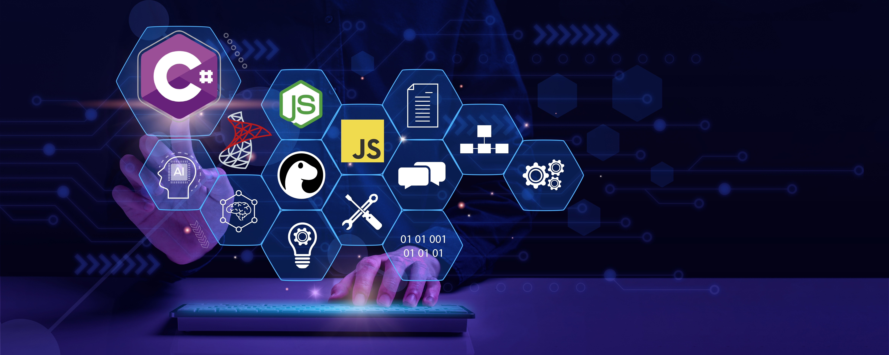
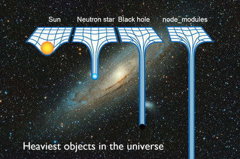

# Ready For New Challenges!

With over a decade of experience in software development, I have successfully worked on diverse solutions, including web and desktop applications, RESTful APIs, and microservices. My technical expertise spans a range of technologies, such as .NET, C#, SQL Server, Node.js, and JavaScript, enabling me to design and implement scalable, efficient systems.

I am a lifelong learner, passionate about emerging technologies such as artificial intelligence, Deno, and Fresh. I also enjoy exploring areas like video editing and am currently learning about Shopify and e-commerce.

If you would like to learn more or have any questions, please feel free to contact me. I am always willing to connect and share ideas!

## My skills

    &nbsp;
    &nbsp;
    &nbsp;
    &nbsp;
    &nbsp;
    &nbsp;
    &nbsp;
    &nbsp;

## Stats

 

&nbsp;&nbsp;&nbsp;&nbsp;

## A little more about me

- 🔭 I'm currently working on my personal project that will help us learn vocabulary in another language more efficiently
- 💻 I’m currently studying Software Developer Certificate at the Manitoba Institute of Trades and Technology (MITT)
- 👯 I’m looking to collaborate on FEDLATAM's Website as a volunteer
- 🤔 I’m looking for help with how to do networking and find better labor opportunities
- 💬 Ask me about what is Deno and Fresh
- 😊 I Enjoy topics about astronomy
- ⚡ Fun fact: What's the heaviest object in the universe?

   

<i>This joke plays on the idea that the node_modules folder is ridiculously large and heavy, even more so than the densest objects in the universe, such as black holes. It's a classic joke among developers who use Node.js.</i> 😄 <i>Fortunately, Deno arrived! More about these interesting topics in [greencode](https://greencode.deno.dev) (under construction)</i>.

## Contact me

How to reach me:

